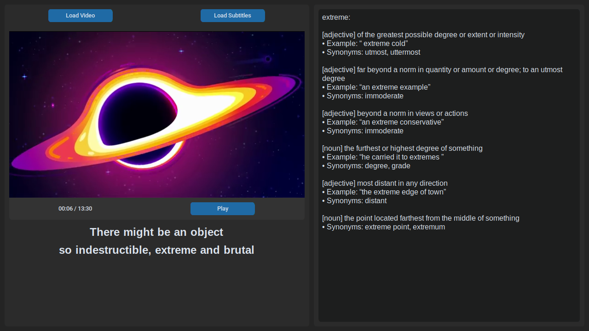

# VocabFlix
#### Learning and entertainment together


***(credits for video in this demo screenshot: [Kurzgesagt – In a Nutshell](https://www.youtube.com/channel/UCsXVk37bltHxD1rDPwtNM8Q))***

**VocabFlix** is a smart video player built with `customtkinter` and `VLC` designed to help users improve their vocabulary while watching videos with subtitles. Hovering over any word in the subtitles shows you its meaning, part of speech, example usage, and even synonyms—fetched live from [vocabulary.com](https://www.vocabulary.com).


##  Features

- **Video Playback (.avi, .mkv, .mp4, .mov, .flv, .webm, .ogg)** using `python-vlc`
- **Subtitle Support (.srt, .vtt)** with real-time synchronization
- **Hover Definitions** from [vocabulary.com](https://www.vocabulary.com/)
- **Synonyms, Examples, POS** display on hover
- **Clean and modern UI** using `customtkinter`


## How to Run

```bash
python -m venv venv                       # Set Up a Virtual Environment
source venv/bin/activate                  # On Windows: venv\Scripts\activate
pip install -r requirements.txt           # Install Dependencies
python src/main.py                        # Run the App
```


## Requirements

Python packages that are handled by requirements.txt:
1. `customtkinter`
2. `python-vlc`
3. `requests`
4. `beautifulsoup4`
5. `lxml`

You need [VLC media player](https://www.videolan.org/vlc/#download) installed on your system for video playback.


## Usage

1. Load a video file using the "Load Video" button.
2. The app will try to automatically load a .srt (if not found then, .vtt) file with the same name.
3. Or, you can load subtitles manually.
4. Hover over any word in the subtitles to get detailed information.


## License

MIT License. Use freely and contribute!
