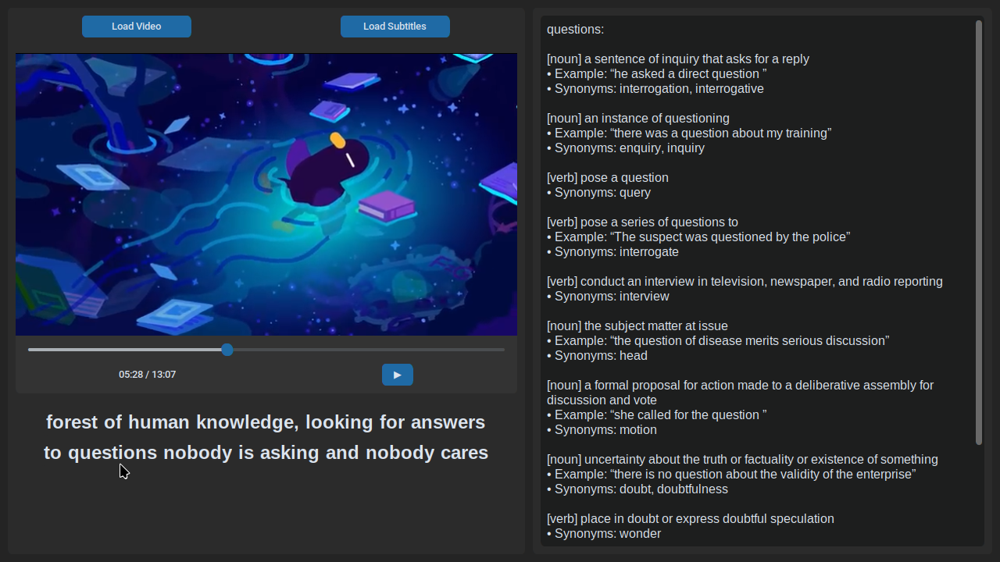

# VocabFlix – Smart Video Player with Interactive Subtitles


**VocabFlix** is a smart video player built with `customtkinter`, `VLC`, and `PyQt5`, designed to help users improve their vocabulary while watching videos with subtitles. Hovering over any word in the subtitles shows you its meaning, part of speech, example usage, and even synonyms—fetched live from [vocabulary.com](https://www.vocabulary.com).

##  Features
- **Video Playback** using `python-vlc`
- **Subtitle Support (.srt)** with real-time synchronization
- **Hover Definitions** from [vocabulary.com](https://www.vocabulary.com/)
- **Synonyms, Examples, POS** display on hover
- **File Dialogs** using PyQt5 for loading video and subtitle files
- **Clean and modern UI** using `customtkinter`

## How to Run
```bash
git clone https://github.com/ChiragBokolia/VocabFlix.git     # Clone the Repository
cd VocabFlix
python -m venv venv                                         # Set Up a Virtual Environment
source venv/bin/activate                                    # On Windows: venv\Scripts\activate
pip install -r requirements.txt                             # Install Dependencies
python src/main.py                                          # Run the App
```

## Requirements
These are handled by requirements.txt, but include:
1. `customtkinter`
2. `python-vlc`
3. `PyQt5`
4. `requests`
5. `beautifulsoup4`
6. `lxml`

## Usage
1. Load a video file using the "Load Video" button.
2. The app will try to automatically load a .srt file with the same name.
3. Or, you can load subtitles manually.
4. Hover over any word in the subtitles to get detailed information.

## License
MIT License. Use freely and contribute!
